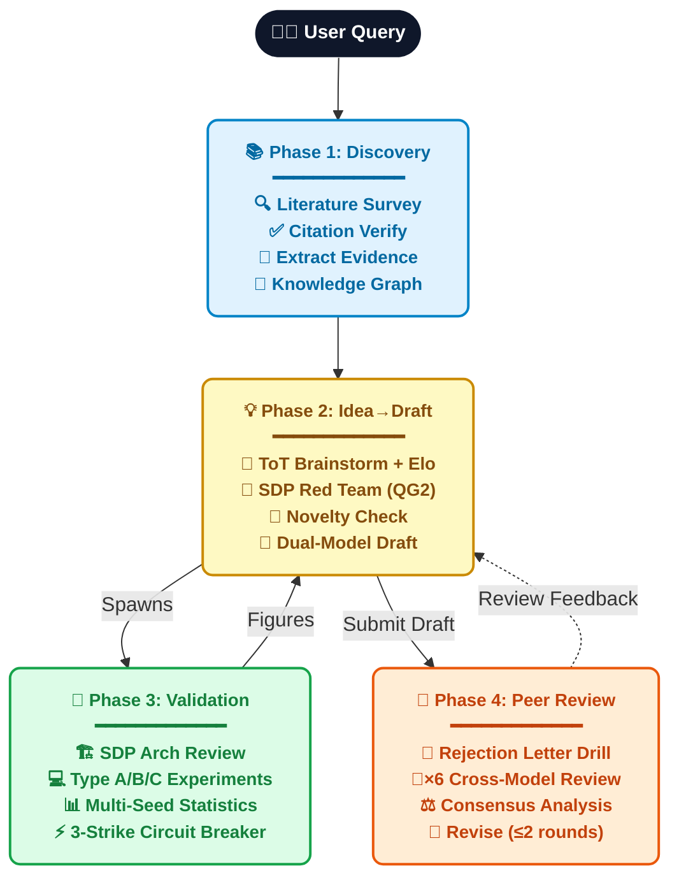

<br />
<div align="center">
  <a href="https://github.com/ChunqiGuo02/NeXus/stargazers"></a>
  <a href="https://github.com/ChunqiGuo02/NeXus/network/members"></a>
  <a href="https://x.com/Chunqi_Guo"></a>
  <a href="LICENSE"></a>
  
  <strong>Query → Survey → Brainstorm → Experiment → Write → Review</strong><br />
</div>


An **agent skill pack** that turns any LLM coding assistant (Antigravity, Claude Code, Opencode, etc.) into a full-stack academic research partner — from literature survey to top-venue paper submission.

> **Not a toy demo.** NeXus ships with 5 quality gates (QG1–QG5), 5 hard checkpoints that Autopilot cannot bypass, 12 layers of anti-mediocrity mechanisms, and full `publishable` evidence traceability from data fetching to final manuscript.

## ✨ What It Does



## 🛡️ Anti-Mediocrity: 12 Layers of Defense

> Every layer exists to prevent the agent from producing incremental, lack-of-novelty, or unprofessional output.

<details>
<summary><strong>🔴 Anti-Incremental (5 layers)</strong></summary>

| Layer | Mechanism | Stage |
|-------|-----------|-------|
| 1 | **Forced Cross-Pollination**: inject 3-5 cross-domain SOTA papers | Survey |
| 2 | **3-4-3 Portfolio Ideation**: 30% Safe / 40% Ambitious / 30% Paradigm Shift | Ideate |
| 3 | **SDP Red Team "Bullshit Detection"**: kill ideas that are incremental in disguise | Ideate |
| 4 | **Core Novelty Invariant**: core method cannot be downgraded even if code fails | Build |
| 5 | **3-Strike Circuit Breaker**: project terminates rather than degrading to ResNet | Build |

</details>

<details>
<summary><strong>🟡 Anti-Lack-of-Novelty (3 layers)</strong></summary>

| Layer | Mechanism | Stage |
|-------|-----------|-------|
| 1 | **Research Frontier Check (QG1)**: scan latest 6-month arXiv for collision | Survey |
| 2 | **novelty-checker hard threshold**: force `unknown` if < 50 papers scanned | Novelty |
| 3 | **Novelty Risk Gate (hard checkpoint)**: Autopilot cannot skip when risk is unknown/high | Novelty |

</details>

<details>
<summary><strong>🟢 Anti-Unprofessional (4 layers)</strong></summary>

| Layer | Mechanism | Stage |
|-------|-----------|-------|
| 1 | **Type-aware QG4**: Type B/C experiments not killed by 1% SOTA threshold | Build |
| 2 | **Multi-seed statistics**: `SEEDS=[13,42,123]` + Cohen's d + Holm-Bonferroni | Build |
| 3 | **Shadow evidence isolation**: full-chain `publishable` filtering from fetch to manuscript | Write |
| 4 | **QG5 publication standards**: 14 checks including DPI, colorblind-safe, de-AI phrasing | Write |

</details>

## 🚀 Quick Start

### 1. Clone

```bash
git clone https://github.com/ChunqiGuo02/NeXus.git
cd NeXus
```

### 2. Install MCP Server

```bash
cd mcp-servers/paper-service
pip install -e .
cd ../..
```

### 3. Configure Your Agent

<details>
<summary><strong>Antigravity</strong></summary>

Add to your MCP config (`mcp_config.json` or via settings):

```json
{
  "mcpServers": {
    "paper-service": {
      "command": "python",
      "args": ["/path/to/NeXus/mcp-servers/paper-service/server.py"]
    }
  }
}
```

Then open Antigravity **in the project directory**. Skills, Rules, and Workflows are auto-discovered from `.agents/`.

</details>

<details>
<summary><strong>Claude Code</strong></summary>

```bash
claude mcp add paper-service python /path/to/NeXus/mcp-servers/paper-service/server.py
cd NeXus && claude
```

Claude Code reads `CLAUDE.md` at project root to discover capabilities.

</details>

<details>
<summary><strong>Other LLM Agents</strong></summary>

1. Copy `.agents/skills/`, `.agents/rules/`, `.agents/workflows/` to your agent's skill directory
2. Configure the MCP server for your framework
3. The skills are plain Markdown — any agent that reads Markdown instructions can use them

</details>

### 4. Start Researching

```
# From scratch
你: /full-research-pipeline "graph neural networks for urban computing"

# Improve a rejected paper
你: /revise-paper (attach PDF + reviewer comments)

# Quick one-off tasks
你: 帮我调研 urban heat island mitigation
你: 帮我想几个 research idea
你: 审一下这篇论文，目标 NeurIPS 2026
```

## 📦 Project Structure

```
NeXus/
├── .agents/
│   ├── skills/                    # 22 Skills (Markdown instructions)
│   │   ├── omni-orchestrator/     # 🎯 Entry point + intent routing
│   │   ├── sdp-protocol/         # 🤝 Structured Debate Protocol (cross-model)
│   │   ├── literature-survey/     # 📚 End-to-end survey pipeline
│   │   ├── citation-verifier/     # ✅ Multi-source citation verification
│   │   ├── claim-extractor/       # 📊 Evidence card extraction (with publishable field)
│   │   ├── evidence-auditor/      # 🔍 Evidence quality audit (QG1)
│   │   ├── pattern-promoter/      # 🧠 Auto-build Knowledge Graph
│   │   ├── paper-ingestion/       # 📥 PDF/arXiv ingestion pipeline
│   │   ├── pdf-to-markdown/       # 📄 PDF parsing (marker-pdf)
│   │   ├── idea-brainstorm/       # 💡 ToT + Elo + SDP Red Team (QG2)
│   │   ├── novelty-checker/       # 🔬 4-level risk + coverage threshold
│   │   ├── deep-dive/             # 📖 In-depth paper analysis
│   │   ├── paper-writing/         # 📝 SDP debate drafting + LaTeX pipeline
│   │   │   ├── overleaf_setup.md  # TexLive + LaTeX Workshop + Overleaf Workshop
│   │   │   └── venue_templates.md # 30+ conference/journal LaTeX templates
│   │   ├── multi-reviewer/        # 👥 6-reviewer SDP + cross-review (QG5)
│   │   │   └── venue_rubrics/     # 12 conference/journal rubrics
│   │   ├── experiment-runner/     # 🧪 Type A/B/C + 3-Strike + multi-seed (QG3/QG4)
│   │   ├── evolution-memory/      # 🧬 Cross-project learning distillation
│   │   ├── repo-architecture/     # 🏗️ Module boundary enforcement
│   │   ├── code-review/           # 🔎 Code review for correctness
│   │   ├── safe-refactor/         # 🔧 Safe, reviewable refactors
│   │   ├── systematic-debugging/  # 🐛 Root-cause-first debugging
│   │   ├── test-author/           # 🧪 Test writing (repo-style)
│   │   └── verification-runner/   # ✅ Verify implementation claims
│   │
│   ├── rules/                     # 7 Rules (always-on constraints)
│   │   ├── citation-integrity.md  # All citations must be verified
│   │   ├── evidence-discipline.md # All claims need evidence + publishable=true
│   │   ├── access-state-policy.md # 7-level access state + Shadow isolation
│   │   ├── engineering-baseline.md
│   │   ├── repo-conventions.md
│   │   ├── verification-policy.md
│   │   └── model-routing.md       # Multi-model stage recommendation
│   │
│   └── workflows/                 # 8 Workflows (orchestration)
│       ├── full-research-pipeline.md  # 8-stage lifecycle + 5 hard checkpoints
│       ├── revise-paper.md            # Rejected/draft paper upgrade (A: fix / B: redo)
│       ├── quick-survey.md            # Rapid survey (1-3 min)
│       ├── bugfix-safe.md
│       ├── hack.md
│       ├── orchestrate-task.md
│       ├── review-changes.md
│       └── verify-result.md
│
├── mcp-servers/
│   └── paper-service/             # MCP Server (Python/FastMCP)
│       ├── server.py              # Entry point
│       ├── shared.py              # Connection pool + retry + cache
│       ├── sources/               # 8 data source integrations
│       │   ├── semantic_scholar.py
│       │   ├── arxiv_source.py
│       │   ├── crossref.py
│       │   ├── openalex.py
│       │   ├── unpaywall.py
│       │   ├── core_api.py
│       │   ├── europe_pmc.py
│       │   └── shadow_library.py  # Sci-Hub/LibGen (configurable)
│       └── tools/                 # 5 MCP tools
│           ├── search_papers.py   # Multi-source concurrent search
│           ├── fetch_paper.py     # 5-tier waterfall + publishable tracking
│           ├── verify_citation.py # Cross-validation + retraction check
│           ├── get_citations.py   # Citation graph
│           └── download_pdf.py    # Secure PDF download
│
├── CLAUDE.md                      # Claude Code entry point
└── README.md
```

## 🔧 MCP Server: paper-service

### Data Sources

| Source | Coverage | Rate Limit |
|--------|----------|------------|
| Semantic Scholar | 200M+ papers, all fields | 100/5min (free), 100/s (key) |
| arXiv | CS/Physics/Math/Bio/Econ | No limit |
| CrossRef | 150M+ DOIs, all fields | 50/s (polite pool) |
| OpenAlex | 250M+ works, all fields | Generous |
| Unpaywall | OA link resolution | Requires email |
| CORE | OA repository | API key optional |
| Europe PMC | Biomedical | No limit |
| Sci-Hub/LibGen | Shadow libraries | Configurable, off by default |

### MCP Tools

| Tool | Description |
|------|-------------|
| `search_papers` | Multi-source concurrent search with dedup |
| `fetch_paper` | 5-tier waterfall: arXiv → OA → Shadow → Manual → Abstract. Tracks `publishable` status |
| `verify_citation` | Multi-source cross-validation + retraction check |
| `get_citations` | Reference/citation graph via Semantic Scholar |
| `download_pdf` | Secure download with path traversal protection |

## 🔄 Workflows

### Full Research Pipeline (`/full-research-pipeline`)

```
Stage 1: Survey → 🔒 Scope Freeze → 🔒 Corpus Freeze
Stage 2: Evidence Audit + Frontier Check (QG1)
Stage 3: Ideate (ToT + Elo + SDP Red Team QG2) → 🔒 Idea Approval
Stage 4: Deep Dive + Novelty Check → 🔒 Novelty Risk Gate
Stage 5: Build (SDP Arch Review → 🔒 Arch Approval → QG3 → 🔒 QG3 Approval → QG4)
Stage 6: Write (SDP Debate Draft + GPT Polish + QG5 + LaTeX Pipeline)
Stage 7: Review (6 Reviewers + Cross-Review) → 🔒 Review Arena
Stage 8: Revise (≤2 rounds) + Evolution Memory
```

🔒 = Human checkpoint. Five of them are **hard checkpoints** that Autopilot cannot bypass.

### Revise Paper (`/revise-paper`)

For rejected papers, unpublished drafts, or preprints:

```
Input: paper + [reviewer comments] + [revision ideas]
  R0: Parse & extract claims
  R1: Diagnose (6-reviewer audit + novelty re-check + gap analysis)
  🔒 R2: Triage Decision (Fix vs Redo)
  → Plan A (Fix): revision plan → supplement experiments → rewrite → re-review
  → Plan B (Redo): inherit assets → full pipeline from Stage 2
```

Both paths go through the **same QG1–QG5 quality gates** — no shortcuts.

### Quick Survey (`/quick-survey`)
```
Multi-source Search → Smart Filter → 20-30 papers → Brief overview (3-5 min)
```

## ✍️ LaTeX & Overleaf Integration

| Component | Purpose |
|-----------|---------|
| **TexLive** | Local LaTeX compilation engine |
| **LaTeX Workshop** | VS Code extension: auto-compile on save + PDF preview + SyncTeX |
| **Overleaf Workshop** | VS Code extension: bidirectional sync with Overleaf cloud |
| **venue_templates.md** | 30+ conference/journal template registry with auto-download |

Auto-detection at write time: the agent checks your environment and only installs what's missing.

## 🤖 Autopilot Mode

Say **"autopilot"**, **"自动完成"**, or **"vibe research"** at any stage:

```
你: /full-research-pipeline "urban computing"
AI: [Survey done, waiting for Scope Freeze...]
你: autopilot
AI: ✅ Autopilot ON. Regular checkpoints auto-approved.
    Hard checkpoints still require your confirmation.
```

**Three-branch behavior:**
- `autopilot + regular checkpoint` → auto-approve with 1-2 line summary
- `autopilot + hard checkpoint` → show details, wait for user (cannot skip)
- `manual mode` → show details, wait for user at every checkpoint

**5 hard checkpoints** (Autopilot never skips):
1. Idea Approval
2. Novelty Risk Gate (`overall_risk: unknown/high`)
3. Architecture Approval
4. QG3 Experimental Design
5. Review Arena

**Auto-stop conditions:**
- Review-Revise loop > 2 rounds
- Score stagnates (delta < 0.5 for 2 consecutive rounds)
- Retracted citation detected
- 3 consecutive API failures
- Core Novelty Invariant 3-Strike breaker

## 👥 Multi-Reviewer Venue Rubrics

12 review rubrics covering AI/ML conferences and cross-domain journals:

| Category | Venues | Key Focus |
|----------|--------|-----------|
| **AI/ML** | NeurIPS, ICLR, ICML, ACL, CVPR, AAAI | Novelty, Soundness, Reproducibility |
| **Top Journals** | Nature, Science, Cell | Significance 30%, Broad Impact |
| **Biology** | PNAS, eLife, Cell Reports | Biological replicates, Statistics |
| **Physics** | PRL, PRX, ApJ | Error analysis, Dimensional consistency |
| **Earth Science** | GRL, JGR, ERL | Data quality, Model validation |
| **Architecture/Urban** | Nature Cities, L&UP, Cities | Practical relevance, Visual quality |
| **Generic** | Any venue | Balanced default weights |

## ⚙️ Configuration

First-run setup creates `~/.nexus/global_config.json`:

```json
{
  "email": "your@email.com",
  "semantic_scholar_key": null,
  "shadow_library_enabled": false,
  "shadow_tls_mode": "strict_then_fallback",
  "search_sources": ["semantic_scholar", "arxiv", "crossref", "openalex"]
}
```

- **email**: Required for Unpaywall and CrossRef polite pool
- **semantic_scholar_key**: [Free API key](https://www.semanticscholar.org/product/api#api-key) to avoid rate limits
- **shadow_library_enabled**: Enable Sci-Hub/LibGen (user responsibility)

## 🔒 Privacy & Security

> [!IMPORTANT]
> NeXus is a fully local agent skill pack. **It does not collect any data.** But it interacts with external services during use — see below.

**Data flow transparency:**

| Data | Sent to | Purpose |
|------|---------|---------|
| Search queries | Semantic Scholar, arXiv, OpenAlex, CrossRef | Literature retrieval |
| Email (optional) | Unpaywall API `mailto` | Higher API quota |
| Paper drafts / ideas | Your LLM provider (Google, Anthropic, OpenAI, etc.) | Writing / review |
| SSH info | Stored locally in `~/.nexus/global_config.json` | Remote experiments |

**What stays local:**
- All project data: `evidence_graph.json`, `hypothesis_board.json`, `corpus_ledger.json`
- Experiment code and results
- All dialogue/handoff files (`dialogue/*.md`)
- `project_state.json` and revision history

**Credentials:**
- `global_config.json` stores API keys in **plaintext** (`.gitignore`'d)
- Overleaf Cookie = login credential — **never paste into chat**, only into VS Code plugin
- Unpublished ideas sent to LLM APIs — check your provider's data policy

**Shadow Library:**
- Sci-Hub / LibGen access **disabled by default** (`shadow_library_enabled: false`)
- May have legal implications in some jurisdictions — enable at your own risk
- Even when enabled, shadow-sourced evidence is **automatically excluded** from final manuscripts (`publishable: false`)

## 📄 License

MIT License — see [LICENSE](LICENSE).

---

<p align="center">
  <em>NeXus — First to the KEY!</em>
</p>
