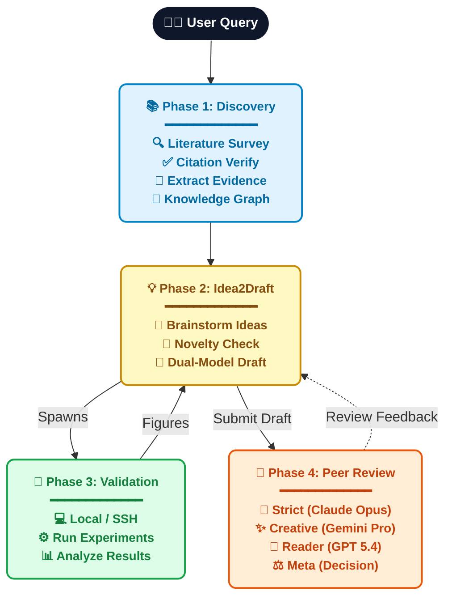

<table border="0" cellspacing="0" cellpadding="20">
<tr>
<td width="140" valign="top" bgcolor="#f6f8fa">
  
</td>
<td valign="top" bgcolor="#f6f8fa">

# NeXus : *the Next-gen Unified Sub-researcher*

<div align="right">
  <a href="https://github.com/abhisheknaiidu/awesome-github-profile-readme/stargazers"></a>
  <a href="https://github.com/abhisheknaiidu/awesome-github-profile-readme/network/members"></a>
  <a href="LICENSE"></a>
  <a href="https://x.com/Chunqi_Guo"></a>
  <br />
  <strong>Query → Survey → Brainstorm → Experiment → Write → Review</strong>
</div>

</td>
</tr>
</table>


An **agent skill pack** that turns any LLM coding assistant (Claude Code, Opencode, Antigravity, etc.) into a full-stack academic research partner — from idea generation to paper writing and peer review simulation.

## ✨ What It Does



## 🚀 Quick Start

### 1. Clone

```bash
git clone https://github.com/ChunqiGuo02/NeXus.git
cd NeXus
```

### 2. Install MCP Server

```bash
cd mcp-servers/paper-service
pip install -e .
cd ../..
```

### 3. Configure Your Agent

<details>
<summary><strong>Antigravity</strong></summary>

Add to your MCP config (`mcp_config.json` or via settings):

```json
{
  "mcpServers": {
    "paper-service": {
      "command": "python",
      "args": ["/path/to/NeXus/mcp-servers/paper-service/server.py"]
    }
  }
}
```

Then open Antigravity **in the project directory**. Skills, Rules, and Workflows are auto-discovered from `.agents/`.

</details>

<details>
<summary><strong>Claude Code</strong></summary>

```bash
# Add MCP server
claude mcp add paper-service python /path/to/NeXus/mcp-servers/paper-service/server.py

# 对于 Claude Code (需要在 NeXus 根目录运行)
cd NeXus
claude
```

Claude Code reads `CLAUDE.md` at project root to discover capabilities.

</details>

<details>
<summary><strong>Other LLM Agents</strong></summary>

1. Copy `.agents/skills/`, `.agents/rules/`, `.agents/workflows/` to your agent's skill directory
2. Configure the MCP server for your framework
3. The skills are plain Markdown — any agent that reads Markdown instructions can use them

</details>

### 4. Start Researching

```
你: 帮我调研 graph neural networks for urban computing
你: 帮我想几个 research idea
你: 审一下这篇论文，目标 NeurIPS 2026
你: 写论文草稿
```

## 📦 Project Structure

```
NeXus/
├── .agents/
│   ├── skills/                    # 18 Skills (Markdown instructions for LLM)
│   │   ├── omni-orchestrator/     # 🎯 Unified entry point + intent routing
│   │   ├── literature-survey/     # 📚 End-to-end survey pipeline
│   │   ├── citation-verifier/     # ✅ Multi-source citation verification
│   │   ├── claim-extractor/       # 📊 Evidence card extraction
│   │   ├── pattern-promoter/      # 🧠 Auto-build Knowledge Graph
│   │   ├── pdf-to-markdown/       # 📄 PDF parsing (marker-pdf)
│   │   ├── idea-brainstorm/       # 💡 Gap-driven idea generation
│   │   ├── novelty-checker/       # 🔍 Prior art risk assessment
│   │   ├── deep-dive/             # 🔬 In-depth paper analysis
│   │   ├── paper-writing/         # 📝 Dual-model debate drafting + Overleaf
│   │   │   └── overleaf_setup.md  # LaTeX/Overleaf integration guide
│   │   ├── multi-reviewer/        # 👥 Multi-model parallel peer review
│   │   │   └── venue_rubrics/     # 12 conference/journal rubrics
│   │   ├── experiment-runner/     # 🧪 Experiment + SSH remote + AutoDL
│   │   ├── repo-architecture/     # 🏗️ Module boundary enforcement
│   │   ├── code-review/           # 🔎 Code review for correctness
│   │   ├── safe-refactor/         # 🔧 Safe, reviewable refactors
│   │   ├── systematic-debugging/  # 🐛 Root-cause-first debugging
│   │   ├── test-author/           # 🧪 Test writing (repo-style)
│   │   └── verification-runner/   # ✅ Verify implementation claims
│   │
│   ├── rules/                     # 7 Rules (always-on constraints)
│   │   ├── citation-integrity.md  # All citations must be verified
│   │   ├── evidence-discipline.md # All claims need evidence cards
│   │   ├── access-state-policy.md # Paper access level policies
│   │   ├── engineering-baseline.md # Small diffs, follow conventions
│   │   ├── repo-conventions.md    # Python/pytest/ruff/mypy standards
│   │   ├── verification-policy.md # Every change needs verification evidence
│   │   └── model-routing.md       # Multi-model stage recommendation
│   │
│   └── workflows/                 # 7 Workflows (orchestration)
│       ├── full-research-pipeline.md  # Complete research lifecycle
│       ├── quick-survey.md            # Rapid survey (1-3 min)
│       ├── bugfix-safe.md             # Evidence-driven bug fixing
│       ├── hack.md                    # Fast, low-ceremony implementation
│       ├── orchestrate-task.md        # Multi-workstream task planning
│       ├── review-changes.md          # Code change review
│       └── verify-result.md           # Result verification
│
├── mcp-servers/
│   └── paper-service/             # MCP Server (Python/FastMCP)
│       ├── server.py              # Entry point
│       ├── shared.py              # Connection pool + retry + cache
│       ├── sources/               # 8 data source integrations
│       │   ├── semantic_scholar.py
│       │   ├── arxiv_source.py
│       │   ├── crossref.py
│       │   ├── openalex.py
│       │   ├── unpaywall.py
│       │   ├── core_api.py
│       │   ├── europe_pmc.py
│       │   └── shadow_library.py  # Sci-Hub/LibGen (configurable)
│       └── tools/                 # 5 MCP tools
│           ├── search_papers.py   # Multi-source concurrent search
│           ├── fetch_paper.py     # 5-tier waterfall fetching
│           ├── verify_citation.py # Cross-validation + retraction check
│           ├── get_citations.py   # Citation graph
│           └── download_pdf.py    # Secure PDF download
│
├── CLAUDE.md                      # Claude Code entry point
└── README.md                      # This file
```

## 🔧 MCP Server: paper-service

### Data Sources

| Source | Coverage | Rate Limit |
|--------|----------|------------|
| Semantic Scholar | 200M+ papers, all fields | 100/5min (free), 100/s (key) |
| arXiv | CS/Physics/Math/Bio/Econ | No limit |
| CrossRef | 150M+ DOIs, all fields | 50/s (polite pool) |
| OpenAlex | 250M+ works, all fields | Generous |
| Unpaywall | OA link resolution | Requires email |
| CORE | OA repository | API key optional |
| Europe PMC | Biomedical | No limit |
| Sci-Hub/LibGen | Shadow libraries | Configurable, off by default |

### MCP Tools

| Tool | Description |
|------|-------------|
| `search_papers` | Multi-source concurrent search with dedup |
| `fetch_paper` | 5-tier waterfall: arXiv → OA → Shadow → Manual → Abstract |
| `verify_citation` | Multi-source cross-validation + retraction check |
| `get_citations` | Reference/citation graph via Semantic Scholar |
| `download_pdf` | Secure download with path traversal protection |

## 👥 Multi-Reviewer: Venue Rubrics

12 review rubrics covering AI/ML conferences and cross-domain journals:

| Category | Venues | Key Focus |
|----------|--------|-----------|
| **AI/ML** | NeurIPS, ICLR, ICML, ACL, CVPR, AAAI | Novelty, Soundness, Reproducibility |
| **Top Journals** | Nature, Science, Cell | Significance 30%, Broad Impact |
| **Biology** | PNAS, eLife, Cell Reports | Biological replicates, Statistics |
| **Physics** | PRL, PRX, ApJ | Error analysis, Dimensional consistency |
| **Earth Science** | GRL, JGR, ERL | Data quality, Model validation |
| **Architecture/Urban** | Nature Cities, Landscape & Urban Planning, Cities | Practical relevance, Visual quality |
| **Generic** | Any venue | Balanced default weights |

## ⚙️ Configuration

First-run setup creates `~/.nexus/global_config.json`:

```json
{
  "email": "your@email.com",
  "semantic_scholar_key": null,
  "shadow_library_enabled": false,
  "shadow_tls_mode": "strict_then_fallback",
  "search_sources": ["semantic_scholar", "arxiv", "crossref", "openalex"]
}
```

- **email**: Required for Unpaywall and CrossRef polite pool
- **semantic_scholar_key**: [Free API key](https://www.semanticscholar.org/product/api#api-key) to avoid rate limits
- **shadow_library_enabled**: Enable Sci-Hub/LibGen (user responsibility)

## 🔄 Workflows

### Full Research Pipeline (`/full-research-pipeline`)
```
Survey → Scope Freeze → Corpus Freeze → Evidence Extraction →
Idea Brainstorm → Idea Approval → Novelty Check → Review Arena →
Paper Writing → Multi-Review → Revision
```

### Quick Survey (`/quick-survey`)
```
Multi-source Search → Smart Filter (citations + recency + novelty) →
20-30 papers → Brief overview (3-5 minutes)
```

### 🤖 Autopilot Mode

Say **"autopilot"**, **"自动完成"**, or **"vibe research"** at any stage:

```
你: 帮我调研 urban computing
AI: [Survey 完成，等待 Scope Freeze...]
你: autopilot
AI: ✅ Autopilot ON. 后续卡点自动通过，随时说"暂停"恢复手动。
    [自动继续 → Corpus Freeze → Ideate → Novelty Check → Write → Review...]
```

- All checkpoints auto-approve with brief summaries
- Safety guardrails: file deletion, git ops, bulk API calls still require confirmation
- Auto-stops after 2 review-revise rounds or if scores plateau


## 🔒 Privacy & Security

> [!IMPORTANT]
> NeXus 是纯本地的 agent skill pack，**不收集任何数据**。但使用过程中会与外部服务交互，请注意以下事项。

**数据流透明度**：

| 数据 | 发送到哪里 | 目的 |
|------|----------|------|
| 论文搜索查询 | Semantic Scholar, arXiv, OpenAlex, CrossRef | 文献检索 |
| 邮箱（可选） | Unpaywall API `mailto` 参数 | 提高 API 配额 |
| 论文草稿/idea | 你使用的 LLM 提供商（OpenAI, Anthropic, Google 等） | 写作/审稿 |
| SSH 连接信息 | 存储在本地 `~/.nexus/global_config.json` | 远程实验 |

**凭据安全**：
- `global_config.json` 以**明文**存储 API Key 和 SSH 信息，已加入 `.gitignore`
- Overleaf Cookie 等价于登录凭证，**请勿粘贴到聊天窗口**，仅在 VS Code 插件中使用
- 未发表的研究 idea（`hypothesis_board.json`）和论文草稿会发送到 LLM API，请确认你的 LLM 提供商数据政策

**Shadow Library**：
- Sci-Hub / LibGen 访问功能**默认关闭**（`shadow_library_enabled: false`）
- 在部分地区使用可能涉及法律风险，请自行评估合规性后再开启

## 📄 License

MIT License — see [LICENSE](LICENSE).

---

<p align="center">
  <em>NeXus — First to the KEY!</em>
</p>
